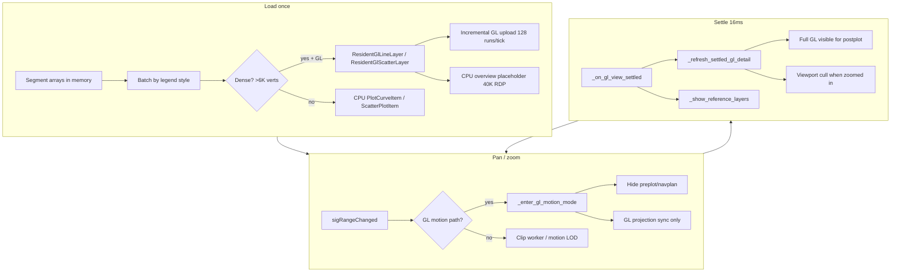

# Map Optimization

Living log of **God Mode** pan/zoom work in xPostMaps. Update this file whenever the interactive map path changes.

Use this as a portable playbook for other GIS, charting, CAD, or canvas apps that choke on large vector layers during camera motion.

---

## One-sentence rule

> **Upload geometry once, move the camera during pan/zoom, restore full detail only after motion settles — never call `setData()` / buffer rebuild on megabyte-scale arrays in the interaction loop.**

---

## What God Mode means here

| Phase | User action | What the map draws | Cost model |
|-------|-------------|-------------------|------------|
| **Motion** | Drag / wheel pan / zoom | Postplot stays visible; preplot & navplan hidden; at full survey extent a lightweight CPU overview placeholder may show | Transform-only GL + optional 40K-point overview |
| **Settle** | User stops (~16 ms debounce) | Full GPU detail for postplot; reference layers restored; dash stipple on CPU when deeply zoomed | One-time visibility / projection sync |
| **Export** | PDF / vector capture | Full-resolution CPU geometry clipped to view | Off interaction path |

**Validated on:** `data/7027.db` — ~2.7K segments, **~2.41M vertices**, 1,350 GL runs per style.

**Benchmark script:** `scripts/brutal_7027_test.py --style all`

---

## Results (7027.db, Mar 2026)

| Postplot style | GL upload | Full-extent pan p95 | Zoomed detail pan p95 | Detail after settle |
|----------------|-----------|---------------------|------------------------|---------------------|
| **Solid** | ~400 ms | ~17 ms | ~22 ms | 1,350 GL line strips |
| **Dotted** | ~460 ms | ~35 ms | ~24 ms | 1,350 GL scatter runs, correct legend colors |
| **Dash** | ~400–2000 ms* | ~18 ms | ~21 ms | 1,350 GL runs + CPU dash curves when deeply zoomed |

\*Dash upload can spike when GL context is reused across back-to-back style tests; interactive pan after upload is still God Mode fast.

**Detail parity checks:** layer counts, visible GL runs, and overview placeholders are verified before vs after pan/zoom torture — no loss of sharpness on settle.

---

## Architecture (current production path)



### Abandoned for **on-screen** display (keep in repo for reference only)

- **Spatial CPU tile grid** — visible square seams on dense surveys
- **Overview Y-flipped raster bitmap** — misalignment vs preplot
- **Per-frame viewport cull during pan** — made zoomed pan slower, not faster

Display path is **resident GL strips/points per survey segment**, not a spatial tile grid.

---

## Core techniques (portable)

### 1. Resident GPU geometry

**Idea:** One GL draw item per logical run (survey segment), uploaded incrementally so the UI stays responsive during load.

| Item | Implementation |
|------|----------------|
| Solid / dash lines | `GLLinePlotItem` line strips — `map_gl_resident_layer.py` |
| Dotted shotpoints | `GLScatterPlotItem` with `glOptions="opaque"` — avoids additive color washout |
| Camera | Orthographic overlay synced to pyqtgraph `ViewBox` — `map_gl_overlay.py` |
| Upload budget | 128 runs per event-loop tick |

**Portable checklist:**
- [ ] Split polylines on NaN / segment boundaries (GL has no `connect="finite"`)
- [ ] Use **opaque** alpha for dense point clouds, not additive blending
- [ ] Align GL parent geometry to the 2D plot viewport, not the full widget (axes margins matter)
- [ ] Keep GL overlay transparent to mouse events

### 2. Three-tier zoom policy

| Zoom level | Detection | Postplot display |
|------------|-----------|------------------|
| Full survey | `view_span >= data_span × 0.90` (`MOTION_VIEW_ZOOM_RATIO`) | CPU overview (40K RDP/scatter pick) while **dragging**; full GL on **settle** |
| Zoomed in | Below ratio | GL transform-only during drag; viewport cull per run bbox on settle |
| Deep zoom + dash | Zoomed in + `LineStyle.DASH` | CPU `PlotCurveItem` with dash pen in visible bbox (GL cannot stipple) |

Constants in `spatial_clip.py`:
- `SCREEN_OVERVIEW_BUDGET = 40_000`
- `MOTION_VIEW_ZOOM_RATIO = 0.90`

### 3. Motion vs settle state machine

```
sigRangeChanged
  → _interacting = True
  → _enter_gl_motion_mode()     # hide reference layers, optional overview
  → start debounce timer (16 ms)

timer fires → _on_gl_view_settled()
  → _finish_pan_interaction()
  → _refresh_settled_gl_detail()
  → _show_reference_layers()
```

**Never** keep RDP overview on screen after GL upload completes and motion has settled.

### 4. Layer routing

| Layer | During pan/zoom | On settle | Dense GL path |
|-------|-----------------|-----------|---------------|
| **Postplot** solid/dash | Visible (God Mode) | Full GL (+ dash CPU if zoomed) | Yes, >6K verts |
| **Postplot** dotted | Visible (God Mode) | Full GL scatter | Yes, >6K points |
| **Preplot** | **Hidden** | Restored | No (CPU only) |
| **Navplan** | **Hidden** | Restored | Yes if >6K verts |
| **Areas / boundary** | Always visible | Always visible | No |

Threshold: `_CLIP_REGISTER_MIN = 6_000` vertices.

Tag GPU layers with `map_layer` (`postplot`, `navplan`, `preplot`) so reference layers can be toggled independently.

### 5. Background workers (fallback / small layers)

For layers not on the GL path, clip and Douglas–Peucker simplification run off the UI thread with a **generation counter** so stale results are discarded.

| File | Role |
|------|------|
| `map_clip_worker.py` | `MapClipTask`, `PrepareMotionTask` |
| `spatial_clip.py` | Numba clip, RDP, spatial grid index |

**Portable checklist:**
- [ ] Worker emits `(generation, bbox, results)`
- [ ] UI ignores callbacks when `generation != current`
- [ ] Do not block pan waiting for worker — keep last geometry or hide layer

### 6. Fast pan math

O(1) pixel drag → world delta (see `map_view_box.py`):

```python
dx_data = -dx_px * x_span / viewport_width
dy_data =  dy_px * y_span / viewport_height
view_box.translateBy(x=dx_data, y=dy_data)
```

### 7. Qt / pyqtgraph tuning

- `SmartViewportUpdate` on the plot viewport
- `DontAdjustForAntialiasing`
- Debounced settle: **16 ms** (`_CLIP_SETTLE_MS`)
- No `DeviceCoordinateCache` on scatter during motion (postplot scatter stays on GL)

### 8. Export path (separate from interaction)

See **[pdf-export.md](pdf-export.md)** for the full PDF generation guide (dialog options, hybrid vector pipeline, Map detail, and performance).

Summary:

- Hide GL overlay; swap resident layers to viewport-clipped CPU geometry for `QPdfWriter`
- **Solid / dash** → print-weight polyline vectors; dash uses explicit custom dash pattern
- **Dotted** → `VectorDotsItem` round vector points (not raster scatter)
- **Map detail** slider decimates at print pixel space when below 100
- Interactive motion LOD is bypassed — export uses full visible-view detail

---

## Line style specifics

| Style | GL during pan | On settle | Visual note |
|-------|---------------|-----------|-------------|
| **Solid** | GL line strips | All runs visible (viewport cull when zoomed) | Round-cap cosmetic pen on CPU export |
| **Dash** | GL strips (continuous) | CPU dash curves when deeply zoomed; GL at survey scale | Stipple only where zoom makes it visible |
| **Dotted** | GL scatter points | All shotpoints on GPU | One marker per vertex; legend colors per batch |

---

## Key files

| File | Role |
|------|------|
| `xpostmaps/ui/map_widget.py` | Orchestration, motion/settle, layer routing |
| `xpostmaps/ui/map_gl_overlay.py` | Ortho GL view, line + scatter runs, viewport cull |
| `xpostmaps/ui/map_gl_resident_layer.py` | GPU-resident solid/dash lines |
| `xpostmaps/ui/map_gl_resident_scatter_layer.py` | GPU-resident dotted shotpoints |
| `xpostmaps/ui/map_vector_dots.py` | Round vector shotpoints for PDF dotted export |
| `xpostmaps/core/pdf_export.py` | Hybrid vector PDF composition |
| `xpostmaps/ui/dialogs/pdf_export_dialog.py` | Export to PDF dialog |
| `docs/pdf-export.md` | PDF export user + developer documentation |
| `xpostmaps/ui/map_view_box.py` | Fast pan translation |
| `xpostmaps/ui/map_clip_worker.py` | Background clip / motion prep |
| `xpostmaps/utils/spatial_clip.py` | Grid index, RDP, overview budgets |
| `scripts/brutal_7027_test.py` | God Mode benchmark + detail parity |

Legacy (not used for interactive display): `map_tiled_layer.py`, `map_tile_worker.py`, `spatial_tiles.py`, `map_overview_raster.py`.

---

## Applying to another product

1. **Profile** — time geometry upload / tessellation / `setData` on your UI thread at target dataset size.
2. **Resident buffers** — upload once; pan = camera/projection change only.
3. **Placeholder tier** — cheap overview while dragging at full extent; full detail on settle.
4. **Layer priorities** — hide non-critical reference layers during motion (optional but cheap win).
5. **Style-specific paths** — points need opaque GL; dashed lines may need CPU stipple when zoomed; do not treat all symbology as polylines.
6. **Worker + generation** — clip/simplify off-thread for anything still on CPU.
7. **Separate export** — never sacrifice interaction for print resolution.
8. **Benchmark + parity** — measure frame p95 *and* verify attribute counts before/after motion.

---

## What did not work

| Approach | Why it failed |
|----------|---------------|
| `setData()` on 730K–2.4M verts during pan | Multi-second UI freeze |
| Spatial **CPU** tile grid on screen | Checkerboard / square seams |
| Overview **raster** bitmap | Y-flip / rotation vs vector preplot |
| Additive GL scatter blending | White blob instead of legend colors |
| Hiding **postplot** scatter during pan | User-visible flicker; unnecessary with GL path |
| Per-frame viewport cull **during** pan | Slower than transform-only GL |
| Uniform vertex decimation | “Wire brush” artifacts on survey turns — use RDP instead |

---

## Change log

| Date | Summary | Commits / notes |
|------|---------|----------------|
| 2026-03 | QGIS-style motion LOD + RDP coarse geometry during pan | `b4aa5c3`, `3b36635` |
| 2026-03 | Spatial GL tiles experiment (later superseded for display) | `3b36635` |
| 2026-03 | Resident GL + CPU overview; fix postplot alignment vs preplot | `4480ca9` |
| 2026-03 | Full GPU detail on settle; CPU placeholder only while dragging at full extent | `a3b8042` |
| 2026-03 | God Mode for **dotted** + **dash** postplot; opaque GL scatter; scatter colors fixed | `59c9594` |
| 2026-03 | Full settle sharpness for dotted/dash matching solid; dash CPU stipple when zoomed | `8b8eb98` |
| 2026-03 | Hide **preplot/navplan** during pan; brutal test all styles + detail parity | `8e1b753` |
| 2026-03 | **This document** created as living optimization log | — |
| 2026-06 | Hybrid PDF export: vector dotted points, custom dash, Map detail; see `pdf-export.md` | `f9631da` |

---

## Benchmark commands

```bash
# All postplot styles (solid, dotted, dash)
python scripts/brutal_7027_test.py --style all

# Single style
python scripts/brutal_7027_test.py --style solid
python scripts/brutal_7027_test.py --style dotted
python scripts/brutal_7027_test.py --style dash
```

**Pass criteria (7027):**
- GL upload completes
- Full-extent pan p95 < 50 ms
- Zoomed detail pan p95 < 200 ms
- Detail parity: GL layer/run counts unchanged; visible detail restored after settle
- Dotted: scatter legend colors match config

---

*Last updated: 2026-03-21 — keep appending to **Change log** when the map path evolves.*
