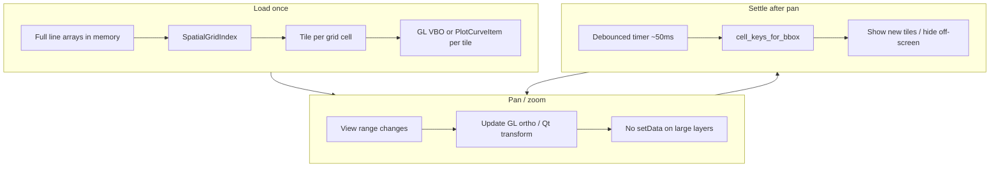

# Interactive Map Performance — What We Did and Why It Worked

This document explains the performance work done on **xPostMaps** (PySide6 + pyqtgraph, ~730K postplot vertices per layer) so the same patterns can be applied to other GIS, charting, or canvas applications.

**Result:** Pan/zoom went from multi-second freezes and “glued” interaction to **snappy, QGIS-class responsiveness** on the same hardware (e.g. Intel i7-10700 + UHD 630).

---

## Highest impact (ranked)

| Rank | Change | Why it mattered |
|------|--------|-----------------|
| **1** | **Spatial grid tiles + geometry uploaded once** | Removed the killer: calling `setData()` / rebuilding paths for hundreds of thousands of points on every view change. Pan became **matrix transform only**. |
| **2** | **GPU-resident lines (`GLLinePlotItem`)** | Vertices live on the GPU; pan/zoom updates projection, not CPU geometry. Integrated UHD 630 handles this easily. |
| **3** | **Never apply large arrays on the UI thread** | Clip, simplify, and tile build run in a **background worker**; the main thread only toggles visibility or swaps small handles. |
| **4** | **Lazy per-tile build** | Only tiles that enter the viewport get built. Load stays instant; cost spreads over first pan. |
| **5** | **Fast pan math (viewport pixels → world delta)** | Right-drag pan uses `viewSpan / viewportSize * pixelDelta` instead of heavy per-frame scene work. |
| **6** | **Shape-preserving motion LOD (RDP)** | For layers still on the CPU path (scatter, pre-settle): Douglas–Peucker beats uniform vertex skipping for curves *and* reduces point count intelligently. |
| **7** | **Scatter hidden during motion** | Dotted shotpoints are expensive markers; hide during drag, restore on settle. Lower impact than line fixes but noticeable on mixed layers. |

**Bottom line:** The win was not one magic constant — it was **stopping full geometry rebuild on pan**. Tiling + GPU made that architectural rule enforceable.

---

## The root problem

On large surveys, a single batched polyline layer had **~344K + ~386K vertices**.

| Operation | Approx. cost |
|-----------|----------------|
| `PlotCurveItem.setData(730K)` on UI thread | **~3+ seconds** (freeze) |
| Pan with coarse LOD + scene cache | ~15–20 ms/frame (acceptable but fragile) |
| Pan with **tiled GL geometry** | **Transform only** — feels instant |

General rule for any toolkit (Qt, WPF, Canvas, Mapbox GL, etc.):

> **If pan/zoom triggers “replace all geometry,” you will lose to a GIS that keeps geometry resident and moves the camera.**

---

## Architecture: before vs after

### Before (slow)

```
Load → one PlotCurveItem with 730K points
Pan  → setData(coarse) or clip → setData(detail) on UI thread
       → QGraphicsScene rebuilds paths → freeze
```

### After (fast)

```
Load → split into spatial grid tiles (lazy)
     → each tile: upload to GPU once (GL) or PlotCurveItem once (CPU fallback)
Pan  → ViewBox / GL projection changes only
Settle → show/hide tiles at viewport edges (cheap)
Scatter only → still uses clip worker + motion LOD
```



---

## Techniques (portable to other apps)

### 1. God Mode (production path for dense solid lines)

**Idea:** Dense solid postplot/navplan lines (>6K vertices) use **GPU spatial tiles** + **overview raster** + **CPU monolithic fallback** when PyOpenGL is unavailable.

| Zoom | Render |
|------|--------|
| Full survey (≥90% extent) | Pre-baked **overview raster** (`map_overview_raster.py`) |
| Zoomed in | **GL tiles** uploaded once per grid cell; pan = ortho projection sync |
| No PyOpenGL | Monolithic `PlotCurveItem` + async view clip (legacy CPU path) |
| Export/PDF | CPU vector tiles per cell (`for_export=True`) |

**Implementation:**
- `xpostmaps/ui/map_tiled_layer.py` — `TiledLineLayer` (GL upload, all polyline runs per cell)
- `xpostmaps/ui/map_tile_worker.py` — tile geometry build off UI thread
- `xpostmaps/ui/map_gl_overlay.py` — `MapGlLineOverlay`, float32 VBO upload
- `xpostmaps/utils/map_overview_raster.py` — hybrid overview bitmap
- `xpostmaps/ui/map_widget.py` — routes dense **solid** lines to God Mode when GL available

**7027.db lesson:** Per-cell **CPU** `PlotCurveItem` tiles showed square seams — never use CPU tiles on screen. GL tiles + overview raster avoid seams and `setData` on pan.

### 2. Spatial grid tiling (internal index)

**Idea:** Partition data by a uniform world grid (~3.5K points per cell) for optional GPU-resident layers. **Screen display** uses one `PlotCurveItem` per legend batch (no per-cell GraphicsItems) so dense surveys do not show a rectangular tile grid.

**When to use:** Optional GL overlay experiments; CPU path uses monolithic curves with deferred `setData` and view clipping on settle.

**Implementation here:**
- `xpostmaps/utils/spatial_clip.py` — `SpatialGridIndex`, `cell_keys_for_bbox`, view clip worker
- `xpostmaps/utils/spatial_tiles.py` — tile builders retained for export/GL experiments
- `xpostmaps/ui/map_tiled_layer.py` — optional; not used for on-screen CPU lines
- `xpostmaps/ui/map_widget.py` — dense solid lines → single curve + motion LOD / async view clip

**7027.db lesson:** Per-cell `PlotCurveItem` tiles produced a visible square grid on dense solid lines (red/blue/orange blocks). One merged curve per batch removes tile seams. Legend apply defers the initial `setData` to the next event-loop tick.

**Portable checklist:**
- [ ] Precompute spatial index at load
- [ ] One GPU buffer or draw item per tile
- [ ] On view change: compute visible cell keys (+ 1 cell margin)
- [ ] Never rebuild visible tiles during pan — only at load or explicit data change

---

### 2. GPU-resident polylines

**Idea:** Upload line vertices to OpenGL once. Pan = orthographic projection matching the 2D map view.

**When to use:** Solid lines, large counts, integrated or discrete GPU with OpenGL 3.1+ / ES 3.0.

**Implementation here:**
- `xpostmaps/ui/map_gl_overlay.py` — `MapOrthoGLView`, `MapGlLineOverlay`, `GLLinePlotItem` per polyline run
- Transparent overlay synced to `PlotWidget` view range; mouse events pass through
- **Fallback:** same tiles on CPU `PlotCurveItem` if PyOpenGL missing

**Portable checklist:**
- [ ] Separate “camera sync” from data upload
- [ ] Split polylines on NaN breaks (GL has no `connect="finite"`)
- [ ] Export / print path uses CPU vector items (GL does not export to PDF scene)

**Dependency:** `PyOpenGL>=3.1.0` (in `requirements.txt`)

---

### 3. Background workers + generation counter

**Idea:** Clip, RDP simplify, and motion-LOD prep run off the UI thread. Stale results discarded via a monotonic **generation** id.

**When to use:** Any O(n) work on 100K+ points (clip, simplify, reindex).

**Implementation here:**
- `xpostmaps/ui/map_clip_worker.py` — `MapClipTask`, `PrepareMotionTask`
- `xpostmaps/utils/spatial_clip.py` — Numba clip, Douglas–Peucker (`screen_line_geometry`, `motion_line_geometry`)

**Portable checklist:**
- [ ] Worker emits `(generation, bbox, results)`
- [ ] UI ignores callbacks when `generation != current`
- [ ] Apply results incrementally (one layer per event loop tick) if needed

---

### 4. Motion LOD — use RDP, not uniform skipping

**Idea:** During interaction, show simplified geometry. **Douglas–Peucker** preserves corners and U-turns; **uniform step decimation** looks like a “wire brush” on curves.

**When to use:** Layers that still must swap geometry during motion (e.g. scatter, non-tiled fallback).

**Constants (this app):**
- Motion line budget: **32K** vertices (RDP)
- Settled view cap: **400K** per layer (full view clip, RDP only above cap)
- View-zoomed motion: clip to viewport first when zoomed below **45%** of layer extent

**Implementation:** `motion_line_geometry()` in `spatial_clip.py`, `_motion_line_data()` in `map_widget.py`

---

### 5. Fast viewport pan

**Idea:** Convert mouse pixel delta to world delta with current view span — O(1) per frame.

```python
dx_data = -dx_px * x_span / viewport_width
dy_data =  dy_px * y_span / viewport_height
view_box.translateBy(x=dx_data, y=dy_data)
```

**Implementation:** `MapViewBox._fast_translate_from_drag()` in `map_view_box.py`

---

### 6. Qt / pyqtgraph viewport tuning

Lower impact alone, but helps once geometry is fixed:

- `QGraphicsView.ViewportUpdateMode.SmartViewportUpdate`
- `OptimizationFlag.DontAdjustForAntialiasing`
- `pg.setConfigOptions(useOpenGL=True)` for 2D scene viewport (fallback path)
- `DeviceCoordinateCache` on CPU curves during motion (when tiling not used)
- Debounced settle timer (**50 ms**) after pan/zoom bursts

---

## Layer routing in xPostMaps

| Layer type | Path |
|------------|------|
| Dense postplot/navplan **solid** lines (>6K pts) | **God Mode:** GL tiles + overview raster (GL) or CPU monolithic fallback |
| Dense **dashed** lines | CPU monolithic + async view clip |
| Dotted shotpoints (scatter) | Clip worker + hide during pan + 40K cap |
| Preplot / areas / small layers | Direct `PlotCurveItem`, no tiling |

Threshold: `_CLIP_REGISTER_MIN = 6_000` vertices.

---

## What did *not* help enough alone

- Hiding lines during pan without fixing `setData` — felt broken, smeared, or glued after settle
- Uniform 4K–8K decimation — fast but ugly on survey turns
- Raster snapshot pan — fragile with Qt coordinate APIs and cache modes
- OpenGL on the 2D `QGraphicsView` only — helps repaint, **does not** fix `setData()` cost

---

## Benchmark reference (3190.db, ~730K vertices)

| Scenario | Approx. behaviour |
|----------|-------------------|
| Full `setData(730K)` | Multi-second UI freeze |
| Uniform 8K coarse preview | ~17 ms/frame pan, poor shape |
| RDP 32K motion LOD | Better shape, ~900 ms precompute off-thread |
| **Tiled GL, pan** | Transform-only; no large `setData` |
| Tile build (lazy, per visible cell) | ~ms–tens of ms per tile, amortized |

---

## Applying this to another product

1. **Profile** — measure `setData` / buffer upload / tessellation on your UI thread.
2. **Resident geometry** — tiles or GPU buffers; pan must not rebuild them.
3. **Worker** — clip/simplify off-thread; generation-guarded apply.
4. **LOD policy** — RDP for lines, uniform pick only for point clouds where shape is irrelevant.
5. **Separate export path** — full resolution for print/PDF; don’t slow interaction for export quality.
6. **Verify on target GPU** — integrated graphics are fine for 2D lines; force high-performance GPU on hybrid laptops.

---

## Key files in this repository

| File | Role |
|------|------|
| `xpostmaps/ui/map_widget.py` | Orchestration, layer routing, settle/motion |
| `xpostmaps/ui/map_tiled_layer.py` | Tile visibility, CPU/GL dispatch |
| `xpostmaps/ui/map_gl_overlay.py` | Orthographic GL overlay |
| `xpostmaps/ui/map_view_box.py` | Fast pan |
| `xpostmaps/ui/map_clip_worker.py` | Background clip / motion prep |
| `xpostmaps/utils/spatial_clip.py` | Grid index, Numba clip, RDP |
| `xpostmaps/utils/spatial_tiles.py` | Lazy tile geometry |
| `requirements.txt` | Includes `PyOpenGL>=3.1.0` |

---

## Commits (chronological summary)

1. **QGIS-style motion LOD** — coarse geometry during pan, full detail after settle  
2. **RDP motion LOD** — shape-preserving simplification instead of uniform skip  
3. **Spatial GPU tiles** — transform-only pan; optional `GLLinePlotItem` overlay  
4. **PyOpenGL in venv / installer** — lock file + installer verification  

---

## One-sentence takeaway

**Keep large vector geometry resident (tiled + GPU), move the camera instead of rebuilding paths, and never let megabyte-scale coordinate arrays touch the UI thread during pan.**

That pattern transfers directly to QGIS-style desktop maps, web MapLibre/Deck.gl layers, game minimaps, CAD viewers, and any pyqtgraph/matplotlib/Qt chart that chokes on `setData()` at scale.
